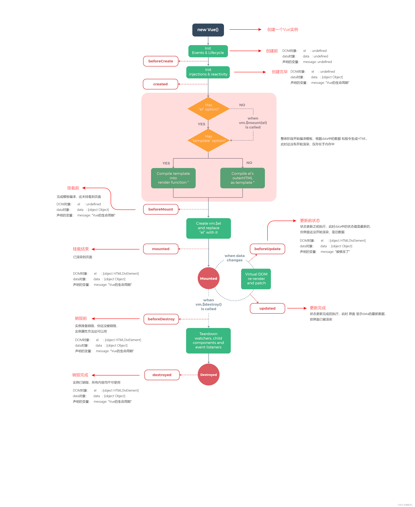

## 基础

### 介绍
[官方文档](https://cn.vuejs.org/)

```text
Vue2选项式API
Vue3组合式API

Vue 获取 时间戳 {{Date.now()}}
Vue 获取 随机数 {{Math.random()}}
```

### 语法

#### ref
```text
若需要响应式变量，需要引入ref，ref包装后为一个对象
import {ref} from "vue";
let count = ref(10);
console.log(count.value)

let str1 = ref("字符串")
let arr1 = ref([1,2,3,4,5])
let obj1 = ref({name:"Japin",age:18})

ref 底层使用的是reactive
```
#### v-bind
```text
v-bind:id 等同于 :id

:class="{className:booleanValue}" 等同于 :class="booleanValue? 'className':''"
:style="{width: '300px',height: 200 + 'px'}" 等同于 :class="booleanValue? 'className':''"
```

#### v-model
```text
原理：通过事件监听，修改数据时重新赋值
```

#### v-on
```text
v-on:click 等同于 @click
```

#### v-if / v-show
```text
区别：
v-if 若为false，则在dom层上删除
v-show 若为false，则仍然在dom上，通过样式display:none隐藏，耗费网络资源
```

#### v-for
```text
v-for="item in value" :key="
v-for="item in arr :key="
v-for="(item,index) in value" :key="
v-for="(item,index) in arr" :key="
1、不加key，会报warning
2、不建议同时使用v-if v-for，建议套层
3、参数index为变量，故key绑定时不应该使用index，而应该使用常量
```
各种类型的for循环遍历
https://blog.csdn.net/qq_18798149/article/details/135089225

### 计算属性
computed单行计算不加{}，若加{}则需要return
```text
computed(计算属性) 和 自定义函数拼接 区别：
computed 缓存，每次调用时，会判断是否需要重新计算，若不需要，则直接返回缓存值
```
### 监听器
```text
若我们需要在状态变化时执行一些“副作用”：例如更改 DOM，或是根据异步操作的结果去修改另一处的状态，计算属性实现不了，需要监听器。
监听器需要import导入，watch 的第一个参数可以是不同形式的“数据源”：它可以是一个 ref (包括计算属性)、一个响应式对象、一个 getter 函数、或多个数据源组成的数组：
注意：不能直接侦听响应式对象的属性值

深层次监听：（深度侦听需要遍历被侦听对象中的所有嵌套的属性，当用于大型数据结构时，开销很大。因此请只在必要时才使用它，并且要留意性能。）
watch(
  () => state.someObject,
  (newValue, oldValue) => {
    // 注意：`newValue` 此处和 `oldValue` 是相等的
    // *除非* state.someObject 被整个替换了
  },
  { deep: true }
)
默认懒加载，若需要即时回调（如想请求一些初始数据，然后在相关状态更改时重新请求数据。）：immediate: true
```

```text
watch vs. watchEffect
watch 和 watchEffect 都能响应式地执行有副作用的回调。它们之间的主要区别是追踪响应式依赖的方式：
watch 只追踪明确侦听的数据源。它不会追踪任何在回调中访问到的东西。另外，仅在数据源确实改变时才会触发回调。watch 会避免在发生副作用时追踪依赖，因此，我们能更加精确地控制回调函数的触发时机。
watchEffect，则会在副作用发生期间追踪依赖。它会在同步执行过程中，自动追踪所有能访问到的响应式属性。这更方便，而且代码往往更简洁，但有时其响应性依赖关系会不那么明确。
```
vue3中computed计算属性和watch监听的异同点详细见
https://blog.csdn.net/qq_18798149/article/details/135302780

### 属性
```text
props 可以使用 defineProps() 宏来声明：
<script setup>
//const props = defineProps(['username', 'avatar'])

const props = defineProps({
		obj: {
			type: Object,
			default () {
				return {
					username: "匿名",
					avatar: "../../static/logo.png"
				}
			}
		}
	})
</script>
```

### 插槽
```text
为子组件传递一些模板片段:<slot></slot>
```
具名插槽:需要多个插槽时
```text
<slot name="header"></slot>
<slot name="footer"></slot>

父组件传递: 
<template v-slot:header>可简写<template #header>
    <!-- header 插槽的内容放这里 -->
</template>
```

### 事件
子传父使用emit，参数1代码事件名字，父级用@事件名接受，参数2为传递的参数
defineEmits(['inFocus', 'submit'])声明发送的事件
```text
子组件
<button @click="$emit('someEvent')">Click Me</button>

父可以通过 v-on (缩写为 @) 来监听事件：
<MyComponent @some-event="callback" />
```

### 生命周期


### defineExpose
子组件暴露数据、方法给父组件使用，父组件通过ref获取子组件实例，再通过实例调用子组件暴露的方法、数据
```text
<script setup>
import { ref } from 'vue'

const a = 1
const b = ref(2)

defineExpose({
  a,
  b
})
</script>
```

### 知识点
#### Vue3语法糖
```text
使用<script setup> 之后，就不需要手动写以下代码，只要写逻辑代码
export default{
 setup(){
 //只要写逻辑代码
   return{***}
 }
}
```
